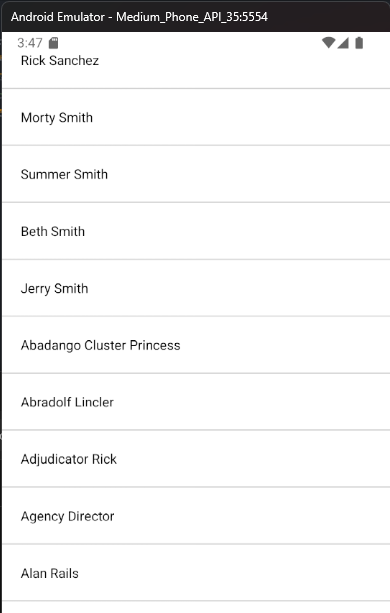

# Prueba tecnica

=========================

## Eliminación de la Importación de la Consola

---

- Se eliminó la línea `import console from 'console';` ya que la consola es un objeto nativo de JavaScript.
- Resultado: El código es más limpio y no se importa una dependencia innecesaria.

## Corrección del Efecto `useEffect`

---

- Se cambió la línea `useEffect(() => { fetchItems(); }, [items]);` por `useEffect(() => { fetchItems(); }, [page]);` para evitar un bucle infinito.
- Resultado: El efecto `useEffect` se ejecuta solo cuando cambia la página `page`, evitando un bucle infinito.

## Mejora de la Función `renderItem`

---

- Se cambió la línea `return items.map((itm) => (` por `return (<View key={item.id} style={{ padding: 20, borderBottomWidth: 1, borderBottomColor: '#ccc' }}><Text>{item.name}</Text></View>);` para evitar la redenrización de toda la lista de ítems.
- Resultado: La función `renderItem` solo redenriza el ítem que le pertenece, evitando la duplicidad de datos.

## Corrección de la Lectura de la Respuesta JSON

---

- Se agregó el `await` en la línea `const data = await response.json();` para esperar a que la promesa se resuelva y obtener la data correcta.
- Resultado: La data se lee correctamente y se puede utilizar en la aplicación.

## Mejora en la Actualización del Estado

---

- Se cambió la línea `setItems(data.results);` por `setItems((prevItems) => (prevItems ? [...prevItems, ...data.results] : data.results));` para mantener el estado anterior y agregar los nuevos datos.
- Resultado: El estado se actualiza correctamente y se mantienen los datos anteriores.

## Listado del fetch en el emulador android

---

